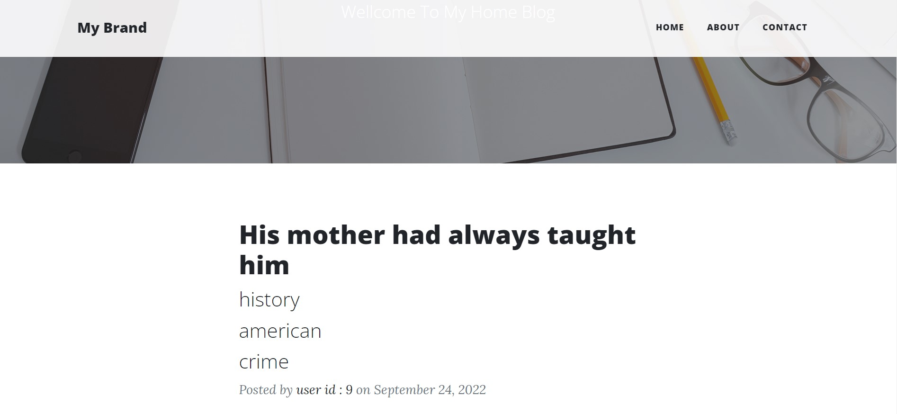
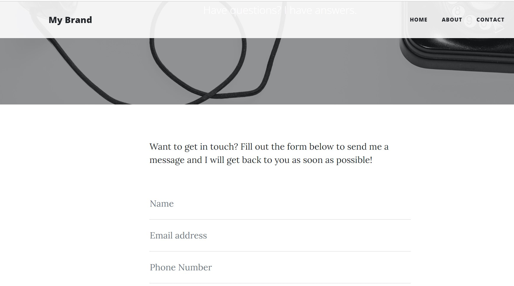

## Blog Website with Jinja and Flask
#### This is a blog website. The project running on : https://replit.com/@ViktoriusSuwand/AppBrewery-python-Day-59-Blog-Capstone-Part-2

### Technology and Features :
    * Bootstrap as Front-End CSS Framework
    * python Flask as Back-End Framework
    * live external API for blog posts
    * Jinja for data transfer with Front-End and Back-End
    * smtp library to get user's contact
    
### Project Overview

#### Home Page

#### Contact Page
